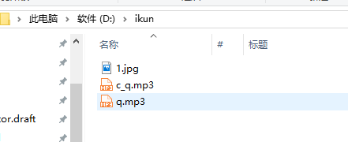

### 0 文件目录
tools是工具目录  
learn_pynput是pynput demo  

### 1 编译方法  
进入3_kun_keyboard_catcher/tools/，执行`pip install -r requirements.txt`安装依赖库，注意playsound库版本最好是1.2.2  
进入到3_kun_keyboard_catcher/tools/中  
执行`pyi-makespec -F -i .\imgs\kun_keyboard.ico -w .\qt_util.py`以生成spec文件  
修改spec文件中`datas=[]`一行，改为`datas=[('audios','audios'),('imgs','imgs')],`，audios，imgs为主函数所在文件同级目录  
修改完之后执行`pyinstaller .\qt_util.spec`就可以生成可执行文件  

如果是自己编译，其中的playsound库中源代码要改一下
```python
def winCommand(*command):
        buf = c_buffer(255)
        # 原始源文件中使用getfilesystemencoding()获取编码方式，在windows下会返回utf，实际上windows要使用gbk，因此下面这行改成我这里的样子
        command = ' '.join(command).encode(getfilesystemencoding() if sys.platform != "win32" else "gbk")
        errorCode = int(windll.winmm.mciSendStringA(command, buf, 254, 0))
        if errorCode:
            errorBuffer = c_buffer(255)
            windll.winmm.mciGetErrorStringA(errorCode, errorBuffer, 254)
            exceptionMessage = ('\n    Error ' + str(errorCode) + ' for command:'
                                '\n        ' + command.decode() +
                                '\n    ' + errorBuffer.value.decode())
            raise PlaysoundException(exceptionMessage)
        return buf.value
```

### 2 使用方法
#### 2.1 自定义图片
在D盘创建一个ikun文件夹，放入名为0.jpg和1.jpg的图片，可以代替闭嘴和张嘴时的图片  
#### 2.2 自定义音频
在D盘创建一个ikun文件夹，放入名为a.mp3的音频，可以在摁下“a”的时候播放；放入名为c_a.mp3的音频，则可以在摁下“CTRL+A”快捷键的时候播放。  

  

### 3 版本迭代

v1.3
 - 支持自定义按键、快捷键声音和图片，方式见使用方法
 - 增加关闭/打开声音选项
 - 使用线程池降低资源开销
 - 由于playsound有不释放资源的bug，使用pygame代替playsound
 - 增加接连摁下组合按键播放指定音频功能（目前仅支持通过代码修改）

v1.2
 - 任务栏不再显示图标
 - 精修声音资源，减少延迟

v1.1  
 - 解决windows下由于playsound库使用utf8编码导致无法正常播放音频的问题  

### 4 常见问题
#### Q：我用音频也是mp3格式，为什么无法播放？
A：有些视频也是mp3后缀结尾，确定这个文件是正常的音频文件。  

#### Q：为什么我会闪退
A：v1.3版本解决内存问题后闪退问题大幅度降低，但还是偶发，目前还在排查中，有能解决的朋友欢迎提pr

### 5 友情链接
iKun表情包：https://github.com/wzwtt/ikun  